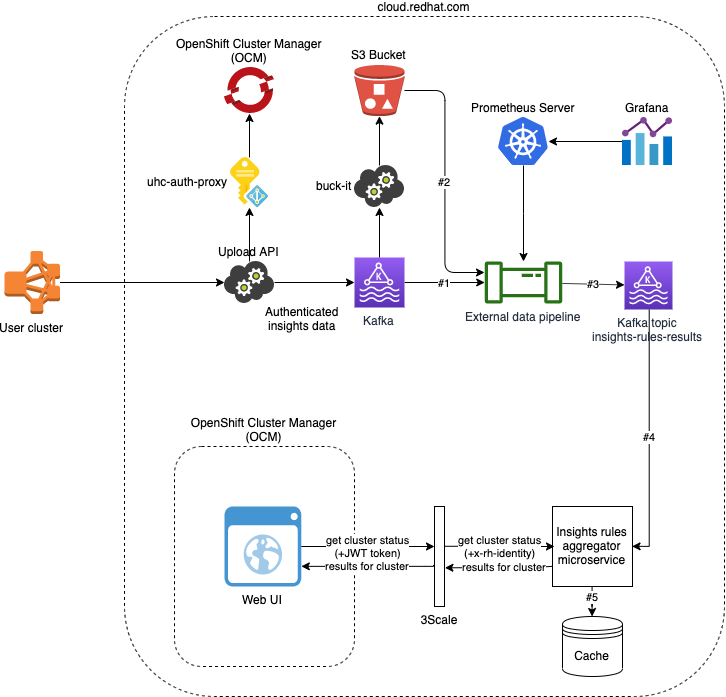

# Insights Results Aggregator

[](https://godoc.org/github.com/RedHatInsights/insights-results-aggregator) [](https://goreportcard.com/report/github.com/RedHatInsights/insights-results-aggregator) [](https://travis-ci.org/RedHatInsights/insights-results-aggregator) [](https://codecov.io/gh/RedHatInsights/insights-results-aggregator)

Aggregator service for insights results

## Description

## Architecture

### Whole data flow



1. Event about new data from insights operator is consumed from Kafka. That event contains (among other things) URL to S3 Bucket
2. Insights operator data is read from S3 Bucket and insigts rules are applied to that data
3. Results (basically organization ID + cluster name + insights results JSON) are stored back into Kafka, but into different topic
4. That results are consumed by Insights rules aggregator service that caches them
5. The service provides such data via REST API to other tools, like OpenShift Cluster Manager web UI, OpenShift console, etc.

## Utilities

### produce_insights_results

This shell script can be used to produce several Insights results into Kafka topic. Its dependency is Kafkacat that needs to be installed on the same machine.

## Documentation for developers

All packages developed in this project have documentation available on [GoDoc server](https://godoc.org/):

* [entry point to the service](https://godoc.org/github.com/RedHatInsights/insights-results-aggregator)
* [package `broker`](https://godoc.org/github.com/RedHatInsights/insights-results-aggregator/broker)
* [package `consumer`](https://godoc.org/github.com/RedHatInsights/insights-results-aggregator/consumer)
* [package `producer`](https://godoc.org/github.com/RedHatInsights/insights-results-aggregator/producer)
* [package `metrics`](https://godoc.org/github.com/RedHatInsights/insights-results-aggregator/metrics)
* [package `server`](https://godoc.org/github.com/RedHatInsights/insights-results-aggregator/server)
* [package `storage`](https://godoc.org/github.com/RedHatInsights/insights-results-aggregator/storage)
* [package `types`](https://godoc.org/github.com/RedHatInsights/insights-results-aggregator/types)

## Configuration

Configuration is done by toml config, default one is `config.toml` in working directory, 
but it can be overwritten by `INSIGHTS_RESULTS_AGGREGATOR_CONFIG_FILE` env var. 

Also each key in config can be overwritten by corresponding env var. For example if you have config

```
...
[storage]
db_driver = "sqlite3"
sqlite_datasource = "./aggregator.db"
pg_username = "user"
pg_password = "password"
pg_host = "localhost"
pg_port = 5432
pg_db_name = "aggregator"
pg_params = ""
...
```

and environment variables 

```
INSIGHTS_RESULTS_AGGREGATOR__STORAGE__DB_DRIVER="postgres"
INSIGHTS_RESULTS_AGGREGATOR__STORAGE__PG_PASSWORD="your secret password"
```

the actual driver will be postgres with password "your secret password"

It's very usefull for deploying docker containers and keeping some of your configuration 
outside of main config file(like passwords).

## Server configuration

Server configuration is in section `[server]` in config file.

```
[server]
address = ":8080"
api_prefix = "/api/v1/"
api_spec_file = "openapi.json"
debug = true
```

 - `address` is host and port which server should listen to
 - `api_prefix` is prefix for RestAPI path
 - `api_spec_file` is the location of a required OpenAPI specifications file
 - `debug` is developer mode that turns off authentication

## Database

By default aggregator uses SQLite3 DB, but also it has support of PostgreSQL. For starting PostgreSQL exist script in folder `local_storage`:
```Bash
./dockerize_postgres.sh
```

For establish connection to PostgreSQL, the following configuration options needs to be changed in `storage` section of `config.toml`:

```
[storage]
db_driver = "postgres"
pg_username = "postgres"
pg_password = "postgres"
pg_host = "localhost"
pg_port = 5432
pg_db_name = "controller"
pg_params = "sslmode=disable"
```

### Migration mechanism

This service contains an implementation of a simple database migration mechanism that allows semi-automatic transitions between various database versions as well as building the latest version of the database from scratch.

Before using the migration mechanism, it is first necessary to initialize the migration information table `migration_info`. This can be done using the `storage.InitMigrationInfo(*storage.DBStorage)` function. Any attempt to get or set the database version without initializing this table first will result in a `no such table: migration_info` error from the SQL driver.

To add a new migration level to the list of available migrations, use the `storage.AddMigration(storage.Migration)` function.

To migrate the database to a certain version, in either direction (both upgrade and downgrade), use the `storage.SetDBVersion(*storage.DBStorage, storage.MigrationVersion)` function.

**To upgrade the database to the highest available version, use `storage.SetDBVersion(db, storage.GetHighestMigrationVersion())`.** This will automatically perform all the necessary steps to migrate the database from its current version to the highest defined version.

See `/storage/migration.go` documentation for an overview of all available DB migration functionality.

## Local setup

### Kafka broker

This service depends on Kafka broker. It can be installed and configured locally. Please follow these steps to configure Kafka:

1. Download the stable Kafka version from [this link](https://www.apache.org/dyn/closer.cgi?path=/kafka/2.4.0/kafka_2.12-2.4.0.tgz)
1. Uncompress downloaded tarball: `tar -xzf kafka_2.12-2.4.0.tgz`
1. Change current directory to a newly created directory: `cd kafka_2.12-2.4.0`
1. Start Zookeeper service: `bin/zookeeper-server-start.sh config/zookeeper.properties`
1. Start Kafka broker: `bin/kafka-server-start.sh config/server.properties`

### Kafka producer

It is possible to use the script `produce_insights_results` from `utils` to produce several Insights results into Kafka topic. Its dependency is Kafkacat that needs to be installed on the same machine. You can find installation instructions [on this page](https://github.com/edenhill/kafkacat).

## Testing

### Unit tests

`make test`

### All integration tests

`make integration_tests`

#### Only rest api tests

`make rest_api_tests`

#### Only metrics tests

`make metrics_tests`
