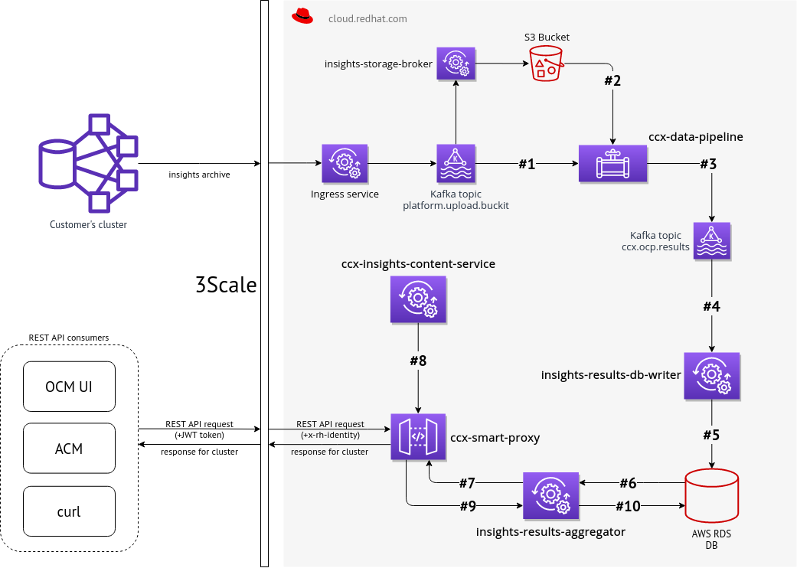

# Architecture

Aggregator service consists of three main parts:

1. Consumer that reads (consumes) Insights OCP messages from specified message broker. Usually Kafka
broker is used but it might be possible to develop a interface for different broker. Insights
2. OCP messages are basically encoded in JSON and contain results generated by rule engine.
3. HTTP or HTTPS server that exposes REST API endpoints that can be used to read list of
organizations, list of clusters, read rules results for selected cluster etc. Additionally,
basic metrics are exposed as well. Those metrics is configured to be consumed by Prometheus and
visualized by Grafana.
4. Storage backend which is some instance of SQL database. Currently SQLite3 and PostgreSQL are
fully supported, but more SQL databases might be added later.

## Whole data flow

1. Event about new data from insights operator is consumed from Kafka. That event contains (among
other things) URL to S3 Bucket
2. Insights operator data is read from S3 Bucket and Insights rules are applied to that data
3. Results (basically organization ID + cluster name + insights results JSON) are stored back into
Kafka, but into different topic
4. That results are consumed by Insights rules aggregator service that caches them
5. The service provides such data via REST API to other tools, like OpenShift Cluster Manager web
UI, OpenShift console, etc.

Optionally, an organization whitelist can be enabled by the configuration variable
`enable_org_whitelist`, which enables processing of a .csv file containing organization IDs (path
specified by the config variable `org_whitelist`) and allows report processing only for these
organizations. This feature is disabled by default, and might be removed altogether in the near
future.
