# [Design] Scalable storage for external data pipeline

27 Apr 2022
Tags: golang, go, rds, database, burst balance

Pavel Tišnovský
Red Hat, Inc.
<ptisnovs@redhat.com>


## Summary (TL;DR;)

* Finished improvements
    - No `ON UPDATE` clause for `rule_hits` table
    - Usage of existing index for `recommendation` table

* Finished spikes/findings
    - `org_id` is numeric, but set as `varchar` in some tables
    - Filter by `reported_at` during retrieving results

* Planned improvements
    - Use one `INSERT` statement to insert multiple rule hits into `rule_hits` table
    - Horizontal partitioning when we reach DB limits (1M of clusters, 10M rule hits)

* Not planned improvements
    - Vertical partitioning


## Finished improvements

### No `ON UPDATE` clause for `rule_hits` table

* write duration is still O(n)
* but write speed is faster
    - in range of 1-10%

#### Write duration

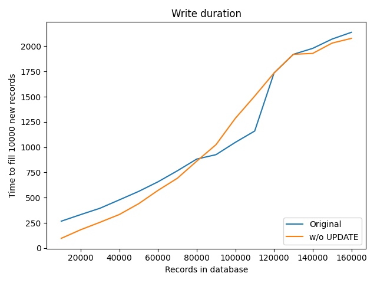

#### Write speed

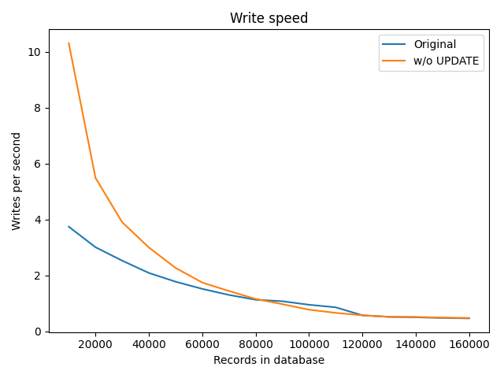


### Usage of existing index for `recommendation` table

* avoid sequential scan
* write duration is O(1)
    - huge improvement

#### Write duration

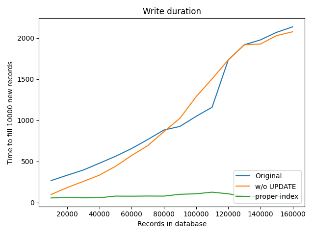

#### Write speed

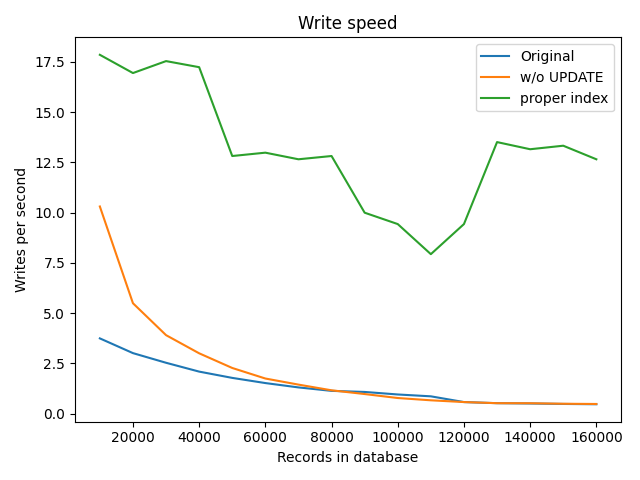


## Finished findings

### `org_id` is numeric, but set as varchar in some tables

* `org_id` needs to be set to numeric type in all tables
* it will shrinken indexes a bit
    - cache improvements
* and it is required schema restriction, of course


### Filter by `reported_at` during retrieving results

* Usually filtering by "less then" etc. is not as effective as using relations
* But it is not blocker there
* Let's see results for a table with 100 organizations and 1000 clusters per organization
    - (which is a lot, usually there are just several cluster per organization)

#### Measurement

```
aggregator=# explain analyze SELECT cluster
FROM report
WHERE org_id = 1
AND reported_at >= '2000-01-01'
ORDER BY cluster;
                                                        QUERY PLAN                                                         
---------------------------------------------------------------------------------------------------------------------------
 Index Scan using report_pkey on report  (cost=0.42..193.63 rows=98 width=37) (actual time=0.035..1.278 rows=1000 loops=1)
   Index Cond: (org_id = 1)
   Filter: (reported_at >= '2000-01-01 00:00:00'::timestamp without time zone)
 Planning time: 0.202 ms
 Execution time: 1.435 ms
(5 rows)
```

```
aggregator=# explain analyze SELECT cluster
FROM report
WHERE org_id = 1
ORDER BY cluster;              
                                                           QUERY PLAN                                                           
--------------------------------------------------------------------------------------------------------------------------------
 Index Only Scan using report_pkey on report  (cost=0.42..193.38 rows=98 width=37) (actual time=0.038..1.019 rows=1000 loops=1)
   Index Cond: (org_id = 1)
   Heap Fetches: 1000
 Planning time: 0.163 ms
 Execution time: 1.195 ms
(5 rows)
```


## Spikes: Possible future improvements

* vertical partitioning
* horizontal partitioning


### Partitioning

* division of table into distinct independent tables
* horizontal
    - by row
* vertical
    - by column
* enables scaling


### Partitioning in Postgres

* method
* partition key
    - column(s) or expression(s)
* partition boundaries
* subpartitioning


### Vertical partitioning

* creating tables with fewer columns
    - additional tables to store the remaining columns
    - not normalization
    - no specific syntax in PostgreSQL
    - query usually consists of several `JOIN`s
* when
    - slow-moving data vs. dynamic data
    - like "disable rule" (if stored in same table as rules!)
    - aggregate functions called frequently over small number of columns


#### Possible use cases for vertical partitioning

* Does some sense for following tables
    - `report`
    - `recommendation`
    - `rule_hit`


#### Vertical partitioning pros and cons

* Pros
    - N/A in our case
    - we don't have slow-moving & dynamic data in the same table
    - (in future - when aggregate functions are to be called over rule FQDNs or error_keys)
* Cons
    - a bit slower DB writes (`INSERT`)
    - a bit slower DB queries (`SELECT`)
* Conclusion
    - not planned to be added in near future


#### Horizontal partitioning

* creating tables with fewer rows
    - additional tables to store the remaining rows
    - specific syntax in PostgreSQL 10.x
* when
    - old data (not used much) vs new data
    - partitioned "naturally" by country, date range etc.


#### Horizontal partition types

##### List Partition

* partitioned by (small amount) of values
* example: disabled column
     - creates two partitions
* not applicable in our case

##### Range Partition

* partitioned by defined range of values
    - `date_from` .. `date_to` etc.
* theoretically applicable in our case

##### Hash Partition

* partitioned by supplying a modulus and a remainder
* each partition contains the rows for which the modulus/hash_of_key=remainder
* theoretically applicable in our case


#### Possible use cases for horizontal partitioning

* Does some sense for following tables
    - `report`
    - `recommendation`
    - `rule_hit`
* How to partition
    - by `org_id` (range)
    - by `org_id` (hash)
    - (basically no "old" and "new" data to partition by date)

#### Measurement

```
aggregator=# select count(*), min(org_id), max(org_id) from recommendation;
 count |  min  |   max    
-------+-------+----------
 35000 | 11804 | 99985512
(1 row)
```

#### Horizontal partitioning pros and cons

* Pros
    - possible speedup when we reach approximately 1M clusters or 10M rule hits
    - when partitioned by org_id (hash), everything's for free
* Cons
    - absolute monstrose syntax + semantic in PostgreSQL < 10.x
    - + indexes must be added to each partition with separate commands
    - partitioning by org_id (range) seems logical, but we are not sure about org_id distribution
* Conclusion
    - not planned yet (for near future)
    - good solution when we reach approximately 1M clusters or 10M rule hits


## Practical part


### Partitioning usage for PostgreSQL before v.10

#### Create master table

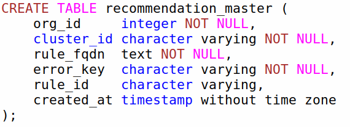

#### Create partitions for defined ranges by hand

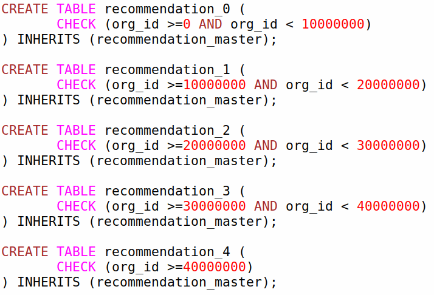

#### It is also needed to create indexes

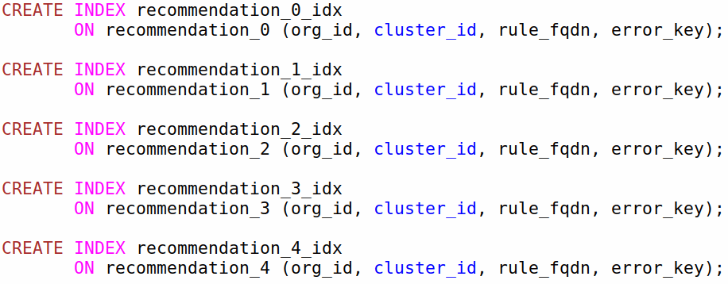

#### A monstrosity - trigger for insering into the right table

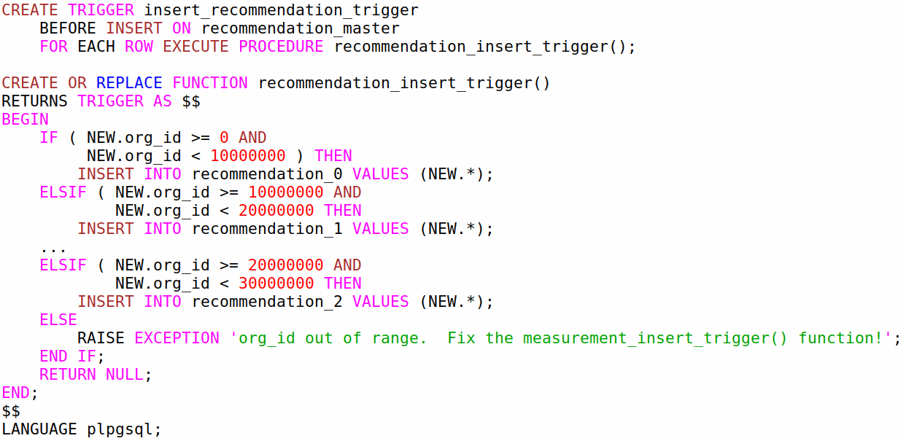


### Partitioning usage for PostgreSQL v.10 - partition by range

#### Create master table

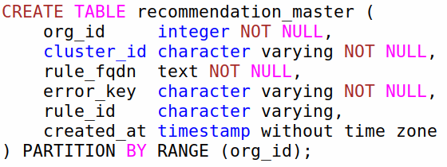

#### Create partitions for defined ranges

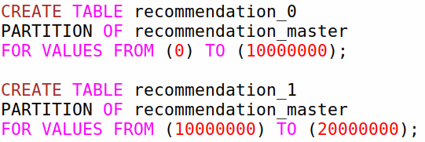

#### Now `INSERT`, `SELECT` etc. are used naturally

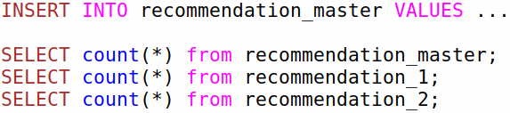


### Partitioning usage for PostgreSQL v.10 - partition by hash

* partition by org_id hash
* basically hash is divided by modulus
* then partition is selected by remainder of hash%modulus
    - partitions size should be similar in this case

#### Create master table

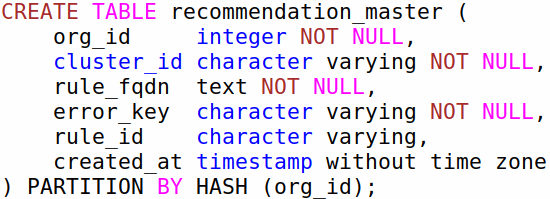

#### Create partitions for all three remainders

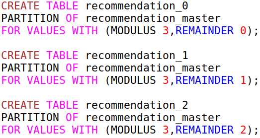
